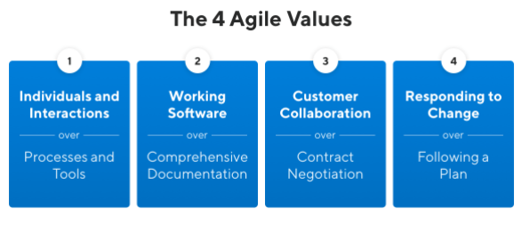
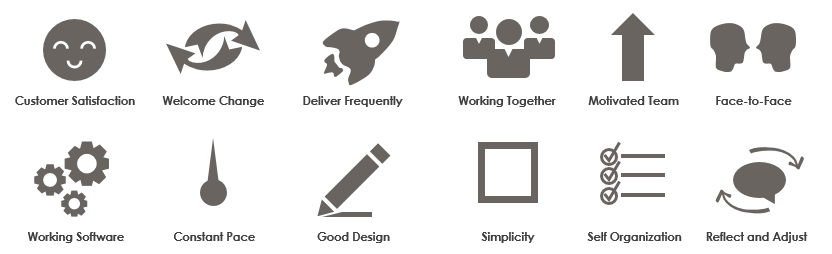

# Agile Big picture

## 4 Agile values 

 
 

## 12 Agile priciples 

* Our highest priority is to satisfy the customer through early and continuous delivery of valuable software.
* Welcome changing requirements, even late in development. Agile processes harness change for the customer’s competitive advantage.
* Deliver working software frequently, from a couple of weeks to a couple of months, with a preference to the shorter timescale.
* Business people and developers must work together daily throughout the project.
* Build projects around motivated individuals. Give them the environment and support they need, and trust them to get the job done.
* The most efficient and effective method of conveying information to and within a development team is face-to-face conversation.**
* Working software is the primary measure of progress.**
* Agile processes promote sustainable development. The sponsors, developers, and users should be able to maintain a constant pace indefinitely.**
* Continuous attention to technical excellence and good design enhances agility.**
* Simplicity–the art of maximizing the amount of work not done–is essential.**
* The best architectures, requirements, and designs emerge from self-organizing teams.**
* At regular intervals, the team reflects on how to become more effective, then tunes and adjusts its behavior accordingly.**

# Scrum is an framework that promotes agile priciples

## Roles

**Product Owner** – Owns the product backlog

**Scrum Master** – One person anyone but the product owner- Facilitator-coach Helps the team to be productive enemy of impediments

**Development Team** – typically 3-9 people – Developers, Testers, BA, DBAs etc

## Artifacts

**Product Backlog**

**Sprint Backlog** – created from Product Backlog

**Increment** – done working software

## Events

**Sprint** – time box – less than 30 days – will have  increment(done working software) as the output – for IAA this is 2 weeks

**Sprint Planning Meeting** – first thing to happen  in  a sprint – choose items from the product backlog that the team thinks are doable – Output sprint backlog

**Daily Scrum Meeting** – 15 mins(never seen this getting over  in  15mins, but should keep it as short as possible ) – discuss progress towards the  increment – discuss impediments

**Sprint Review** – 2nd last thing that happens  in  a sprint – show off the  increment(demo)

**Mid sprint demo** – if it makes sense

**Sprint Retrospective** – Last thing  in  a sprint, what went well, improvements next time? – Limit mistakes to a single sprint

